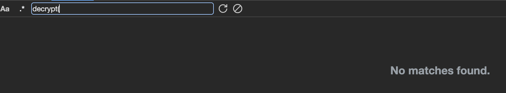
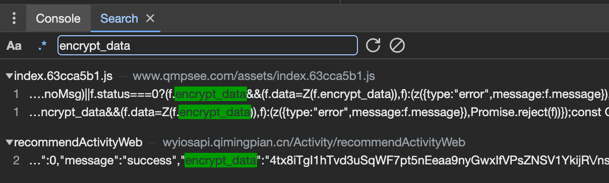

目标地址：
    https://www.qmpsee.com/information

级别:
    入门简单

用到方法：
    纯扣js

步骤：
1. 使用关键字 decrypt(  发现没有搜索到结果。

    
2. 发现返回数据带encrypt_data,尝试使用它来搜索，打断点，找到了位置


```JavaScript
M.interceptors.response.use(({data: f, config: c})=>{
    var i;
    const s = c;
    return D.includes(f.status) ? Promise.reject(f) : ((i = s == null ? void 0 : s.config) == null ? void 0 : i.noMsg) || f.status === 0 ? (f.encrypt_data && (f.data = Z(f.encrypt_data)),
    f) : (z({
        type: "error",
        message: f.message
    }),
    Promise.reject(f))
}
);
```
4. 开始一步步调试，分析，找到这个 Z(f.encrypt_data)
5. 找到Z函数
```JavaScript
function Z(f) {
    return JSON.parse(N("sjdqmp20161205#_316@gfmt", J.decode(f), 0, 0, "012345677890123", 1))
}
```
6. 缺什么函数补什么函数，就得到结果了。