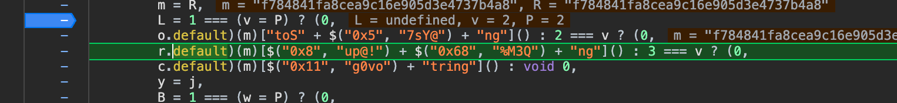

- 目标地址：https://m.cnhnb.com/
- 目标url：
https://appapi.cnhnb.com/recq/api/transform/supply/v501/index

- 难度：简单偏高
- 用到方法：


实现步骤：
1. header里有一堆X-Client-xxxx的内容，这些就是需要逆向得到的值
2. 通过关键词搜`X-Client-Nonce`，找到了一个地方，断点直接断住

3. 堆栈往回找，看是哪里在调用生成这个函数的值，找到了一个循环，在在函数外，
打断点，看看能不能得到数据


看到除了sign值，其他值都得到了。
4. 点击进入l.default查看源码，一大段混淆后的代码

5. 在结尾处打上断点

可以看到返回的结果 head就包含了所有的数据


**接下来进入核心，该案例使用纯算。**
6. 在return返回结果处打上断点

扣走K的值

```javascript
K = {
    "nonce": "f784841fa8cea9c16e905d3e4737b4a8",
    "timestamp": "1716381656086",
    "deviceId": "b4caa38-8dd2-4cb5-941a-61a265617",
    "secret": "EOi^0N5sWWHhkrF2A0gekY9U20BgnAcr",
    "secretType": 2
}
```
7. 本地创建huinong.js文件,然后再浏览器查看每个加密值是什么
8. 遇到了第一个有逻辑性的地方，三目运算符

断点断到这里，然后单步调试，发现走了第二步。

9. 打印一下这串混淆代码得到的值

 得到结果相当于这样`r.default(m)["toString"]()`

10. 看到32位，第一反应是md5摘要，尝试对123456进行运算

确定了就是md5加密，也可以单步调试，多调用几次查看加密，
大概单步运行20次的样子，看到了md5

11. 保持浏览器的K与js中K一致，然后运行得到结果，可以看到两个都一样
12. 同理，得到B的值，依旧单步一直运行，查看加密方式，是SHA1的方式


13. 同样在K相同，运行打印一下确保浏览器和js得到的值是一样的
