地址：https://souke.xdf.cn/search?cityCode=510100&kw=%E8%8B%B1%E8%AF%AD

参数请求：https://dsapi.xdf.cn/product/v2/class/search?appId=5053&cityCode=510100&t=1715752044186&pageIndex=2&pageSize=12&keyword=%E8%8B%B1%E8%AF%AD&order=0

任务：获取Sign值构建
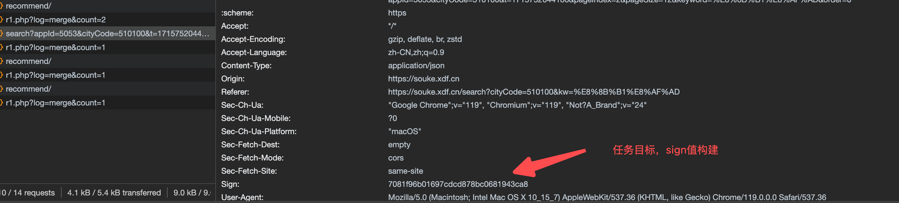

用到方法：
md5，webpack(选用),

步骤：
1.尝试使用路劲搜索  class/search 
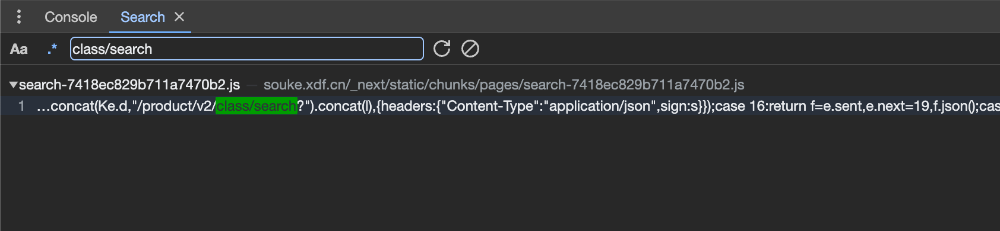

2. 就一个结果，定位到为止，尝试打断点，重新运行
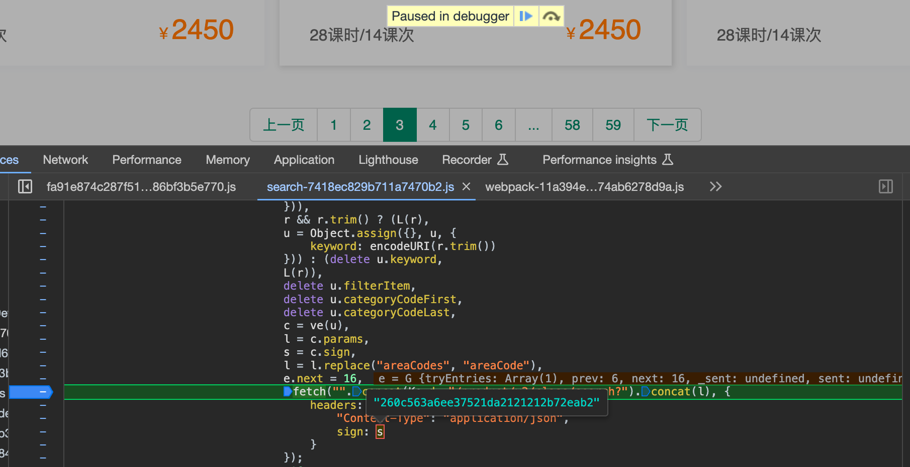


3.可以看到sign值就是s，s=c.sign,而c=ve(u),重新加断点定位ve函数
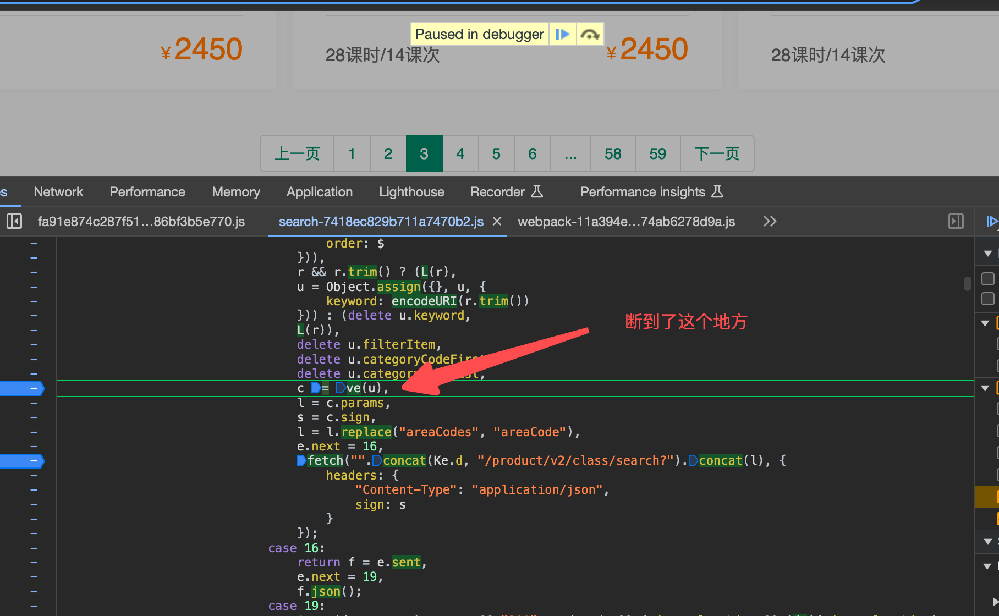

4. 定位到ve函数
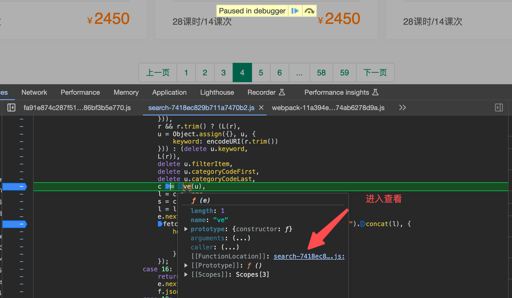

5.在ve函数中加断点，找到sign生成的地方
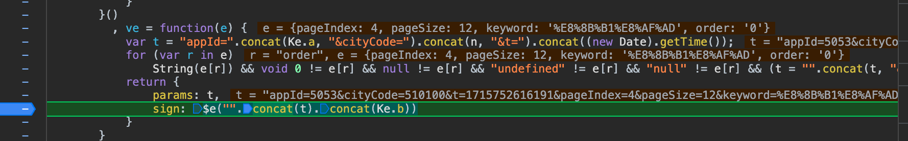

6.这个sign值有点像md5加密，尝试md('123456'),确认了$e()就是md5加密
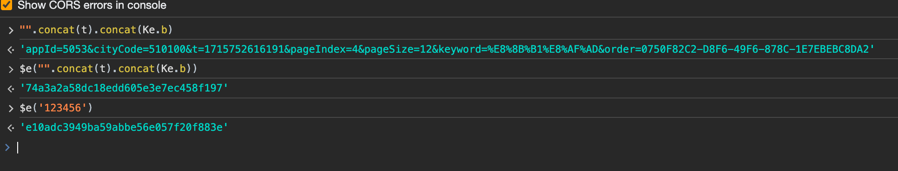

7.sign值的加密，就是```appId=5053&cityCode=510100&t=1715752616191&pageIndex=4&pageSize=12&keyword=%E8%8B%B1%E8%AF%AD&order=0``` + ```Ke.b```
而Ke每次请求发现都是固定值。得到了最后加密结果

### 扩展，如果Ke的值不是固定的，我应该怎么去找呢？
在sign值加密的地方往上面翻了一下，找到了Ke的值
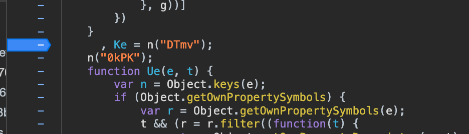

发现只有清空数据缓存，重新reload时，才执行了这一句
n是一个webpack调度器
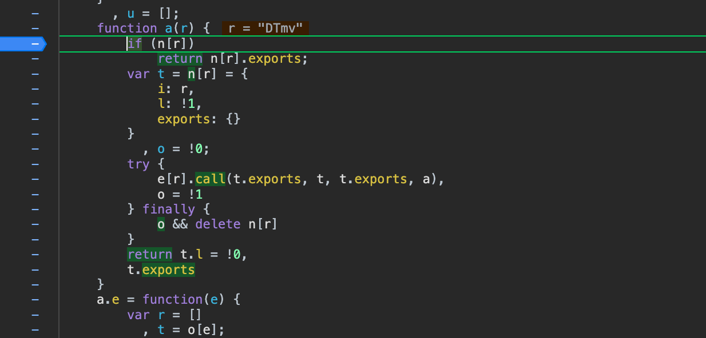
直接复制整个代码 loader
添window=global; 并且把这个调度器a赋值给一个全局变量window.loader
最后运行代码，报错缺什么，就去源码找什么
```
Ke = window.loader("DTmv")
console.log(Ke.a);
console.log(Ke.b);
```

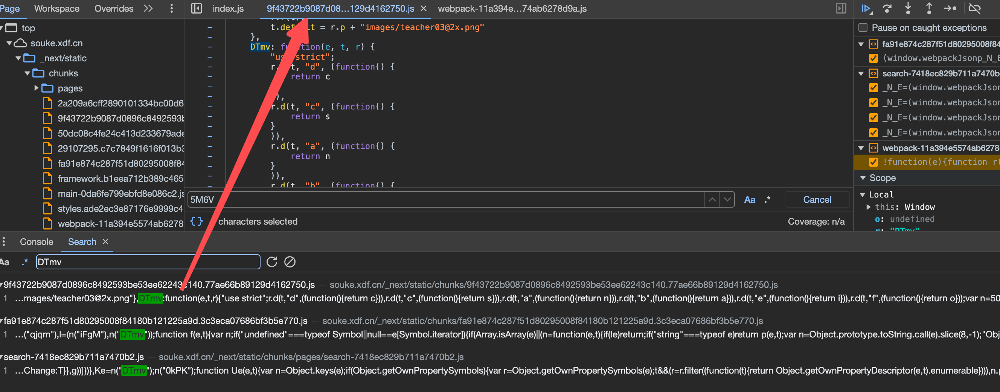
找到data后，在上面加入`window=global;`
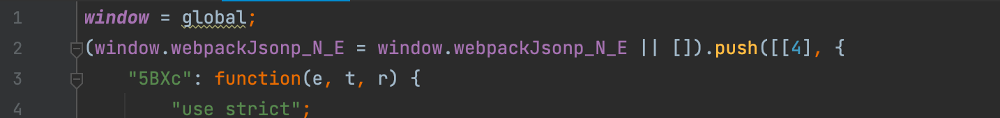