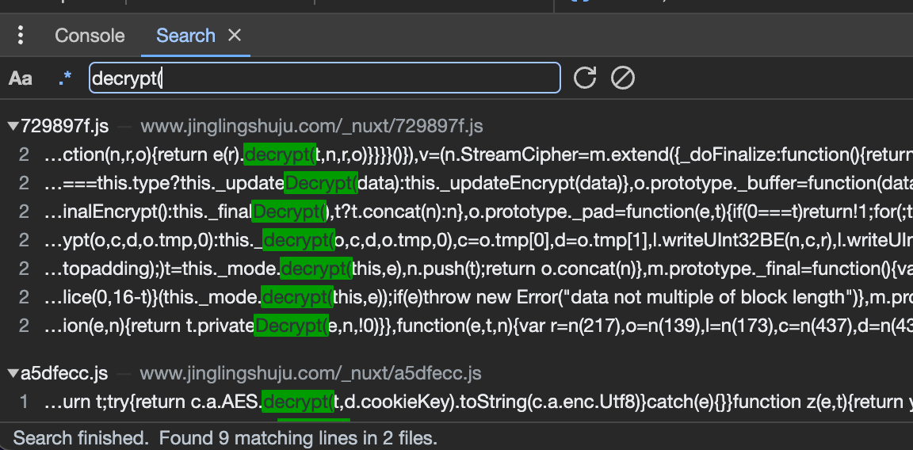
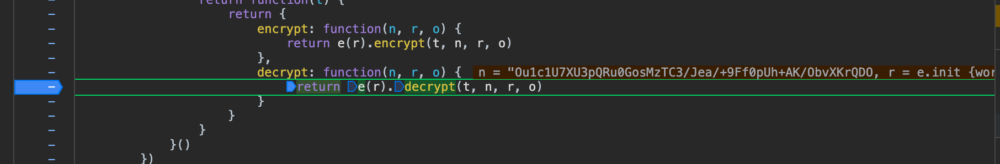
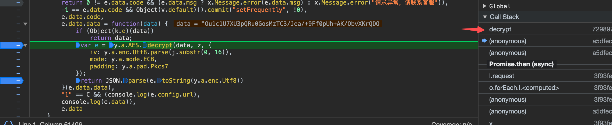
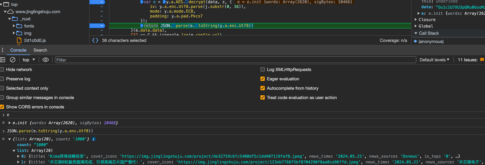

目标地址：https://www.jinglingshuju.com/articles

找到数据接口：
https://vapi.jinglingshuju.com/Data/getNewsList

大致看了一下，参数和请求头都没有加密数据，唯有response数据是加密的。

步骤： 
1. 尝试搜索`decrypt(`

数据量不大，可以打断点试试
2. 发现只在一个地方断住

3. 看了下返回结果，还没有明文显示，像是返回了一堆数组。从堆栈往前找了一下

这个地方就有点像了，之前断点没断住，在这里多打几个。
4. 打了断点，重新执行，可以确定，结果就是在这里
