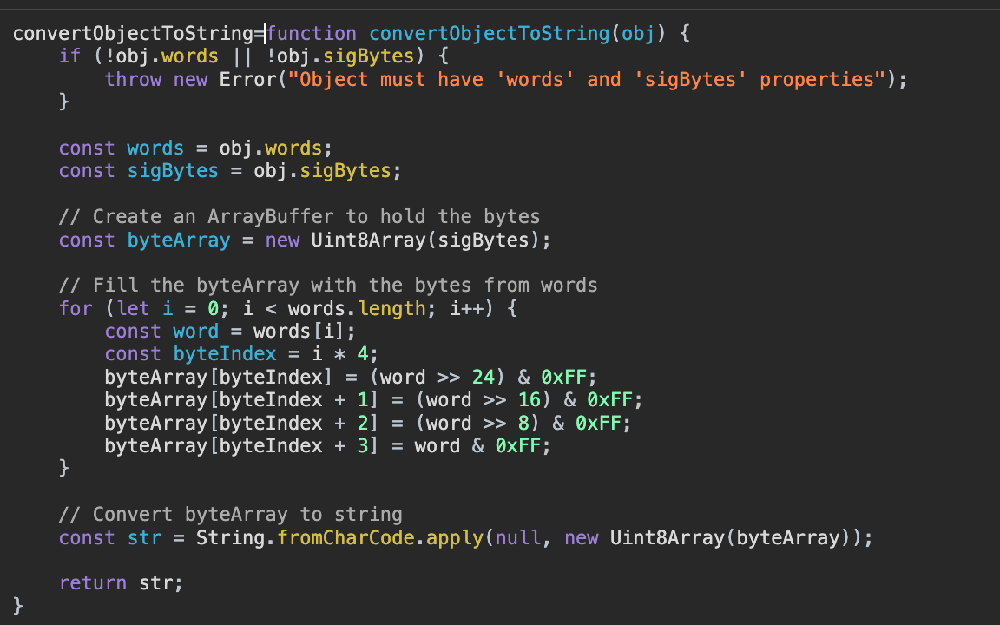

目标地址：https://www.jinglingshuju.com/articles

找到数据接口：
https://vapi.jinglingshuju.com/Data/getNewsList

大致看了一下，参数和请求头都没有加密数据，唯有response数据是加密的。

步骤： 
1. 尝试搜索`decrypt(`

数据量不大，可以打断点试试
2. 发现只在一个地方断住

3. 看了下返回结果，还没有明文显示，像是返回了一堆数组。从堆栈往前找了一下

这个地方就有点像了，之前断点没断住，在这里多打几个。
4. 打了断点，重新执行，可以确定，结果就是在这里

5. 可以看到是AES的ECB，key,iv都在。

6. 使用常用工具，obj转str
```javascript
function convertObjectToString(obj) {
    if (!obj.words || !obj.sigBytes) {
        throw new Error("Object must have 'words' and 'sigBytes' properties");
    }

    const words = obj.words;
    const sigBytes = obj.sigBytes;

    // Create an ArrayBuffer to hold the bytes
    const byteArray = new Uint8Array(sigBytes);

    // Fill the byteArray with the bytes from words
    for (let i = 0; i < words.length; i++) {
        const word = words[i];
        const byteIndex = i * 4;
        byteArray[byteIndex] = (word >> 24) & 0xFF;
        byteArray[byteIndex + 1] = (word >> 16) & 0xFF;
        byteArray[byteIndex + 2] = (word >> 8) & 0xFF;
        byteArray[byteIndex + 3] = word & 0xFF;
    }

    // Convert byteArray to string
    const str = String.fromCharCode.apply(null, new Uint8Array(byteArray));

    return str;
}
```
得到key，iv的值



6. 直接用AES进行解密得到结果，不过我得到的结果看起来没有中文，是编码后的。使用decode(utf8）
也没用，试了下json.loads才行，，，不过得到结果就行了。
