- 目标地址 ：https://cd.ke.com/
- 目标接口 ：https://clogin.ke.com/authentication/authenticate
- 目标内容：登录的密码加密

步骤：
1. 找到加密入口
 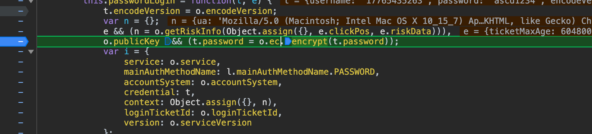
2. o.ec.encrypt(t.password)，这个o是需要找到的目标
3. 在作用域内寻找，找到o的值
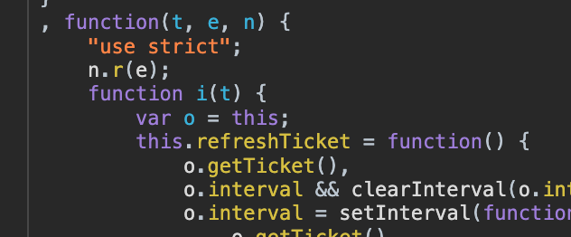
4. 所以i()函数，执行，o就有了，找i函数哪里执行的。
5. 发现整个文档是一个webpack的调度，可以使用替换
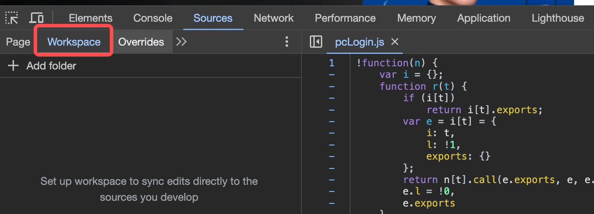
6. 选择替换内容
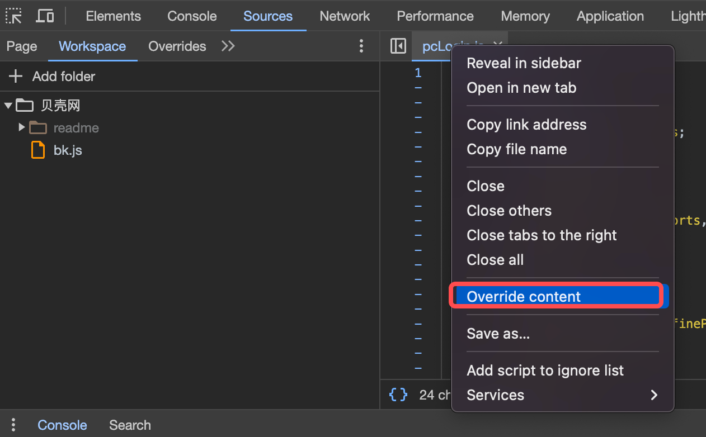
7. 在代码中加入window.loader,注意保存，才生效。
首先看到是undefined，
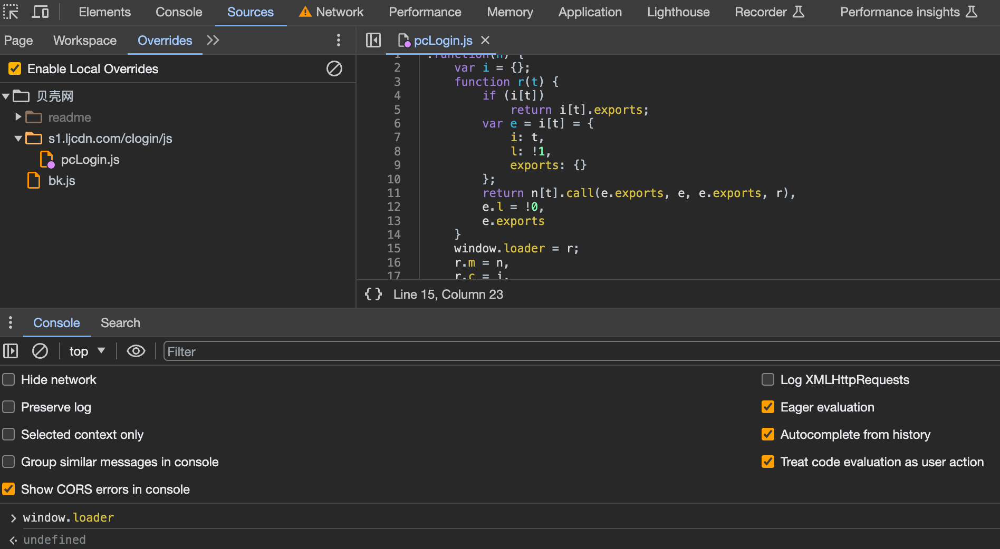
重新运行后，再看，loader就有数据了
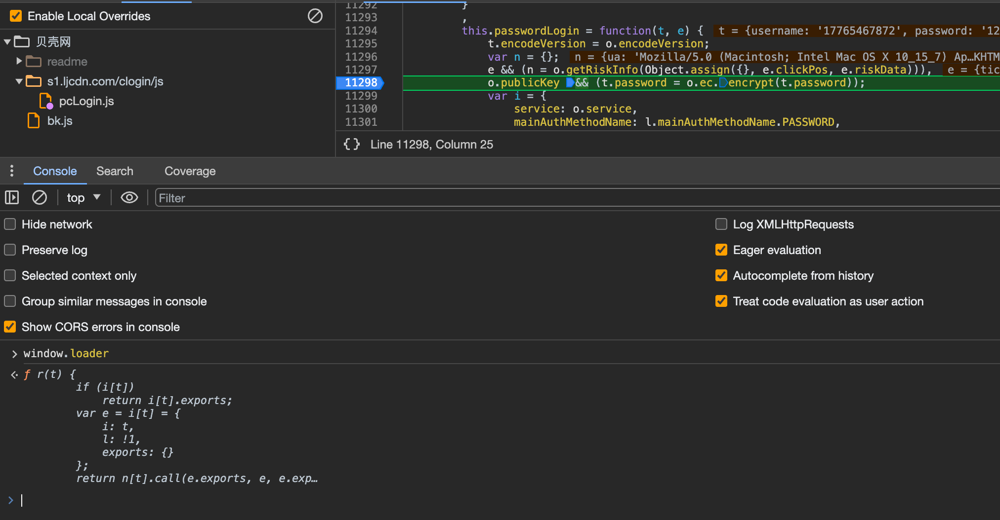
8. 看到一共72个调度函数，而现在目标就是找我们的i函数所在的调度函数
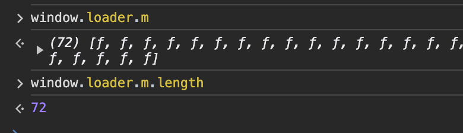
9. 使用循环，查找每一个函数和它对应的位置0-71 `window.loader.m.forEach(function(i,j){console.log(i,j)})`
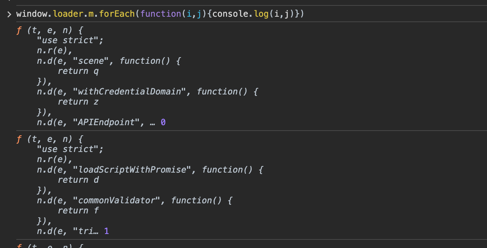
10. 找到i函数所在的函数里，特有的值。
首先把i转字符串，然后查询`p.ec.encrypt()`所在的字符串的下标，查到是第62个调用
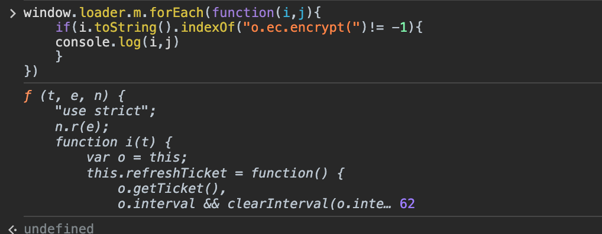
11. 复制代码到本地bk.js中，找到起始调用位置，看到起始调用21，直接屏蔽，我们直接调用62
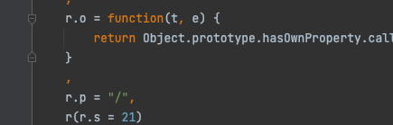
12. 然后简单补一下环境就好了,找到this.ec，直接全局赋值
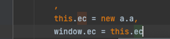
13. 在i函数所在的这段调度代码，返回了default = i，所以执行`window.loader(62).default()`，相当于执行了i()函数，此时o就有了
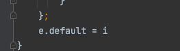
14. 运行脚本，报t相关错误，直接屏蔽。没有去补t环境，如果报错，再另行处理
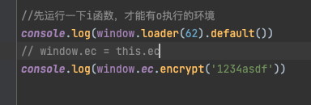
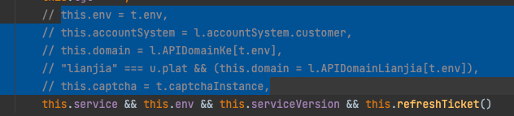
15. 最后得到加密结果
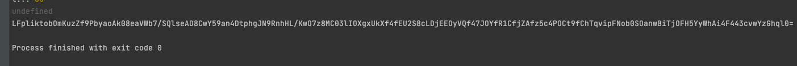