url：
```
https://www.kugou.com/yy/html/search.html#searchType=song&searchKeyWord=%E5%91%A8%E6%B7%B1
```

目标接口：
```angular2html
https://complexsearch.kugou.com/v2/search/song
```

使用方法：

步骤：
0. 尝试了 signature，dfid等值，都没有搜出来

1. 通过搜索路径名`search/song`定位到一个地方，直接打断点，发现此时参数op已经包含了一些数据，但是没有signature
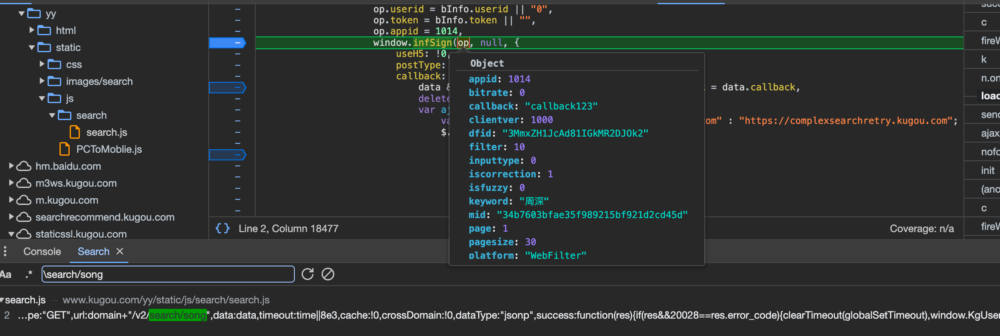
2. 再执行一下，到下面执行callback时，又有了signature，就开始从堆栈往回调
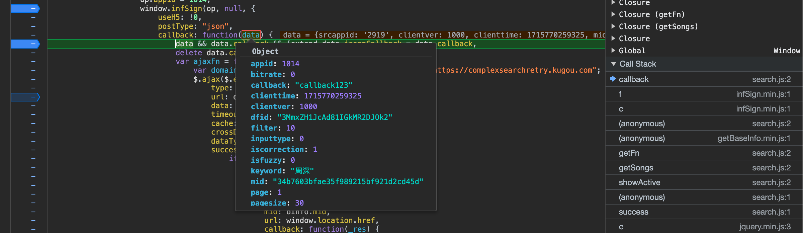
3. 往回调，看看哪里生成的signature
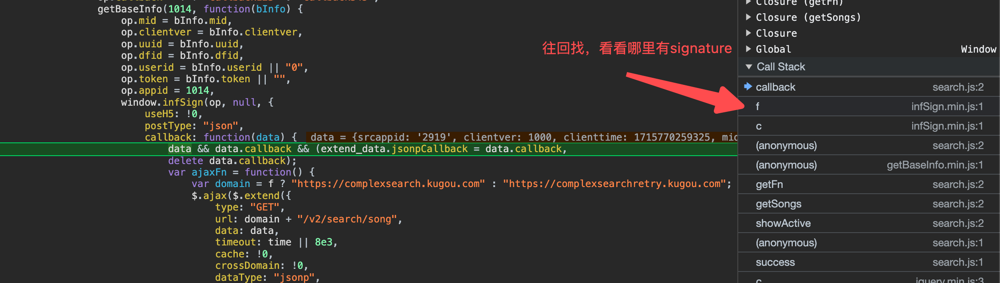
4. f这里，发现有signature值
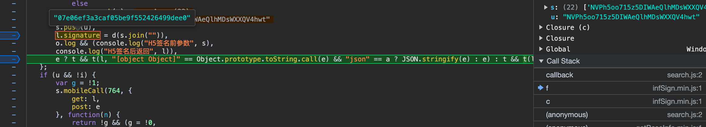
5. 再往回找一下，c没有发现有价值的东西；再回一下，就发现回来了。那么signature一定是f这里生成的
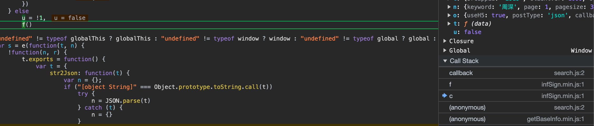
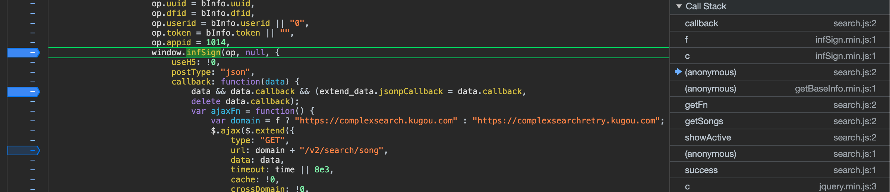
6. signature这里，是一串字符串执行d()函数，看起来像md5，试了一下，果然是md5，现在目标就是找到这串字符串了。
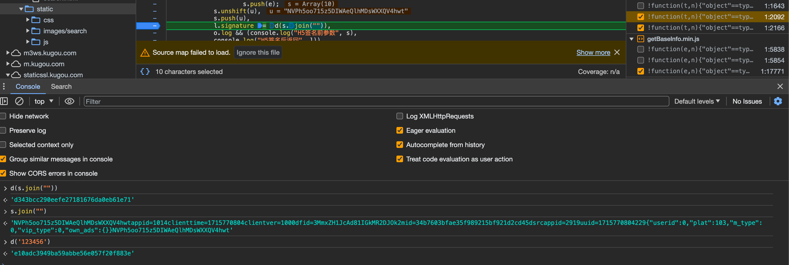
7. 值得注意的时，这个地方不止我们目标接口会调用，其他接口也会调用，需要尤其注意这个字符串的值，是我们传入的参数才对
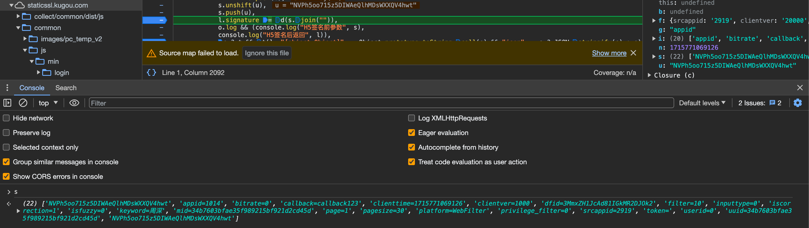
8. 仔细比对参数，就是我们的参数，按字母排序传入，然后前后都加入一个u
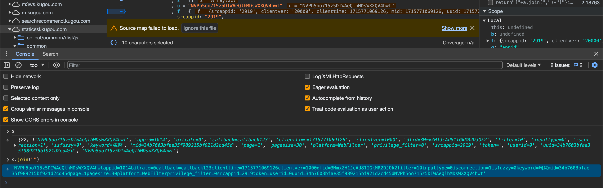
9.开始写python，拼接参数，获取md5加密的signature值。发送请求获取结果
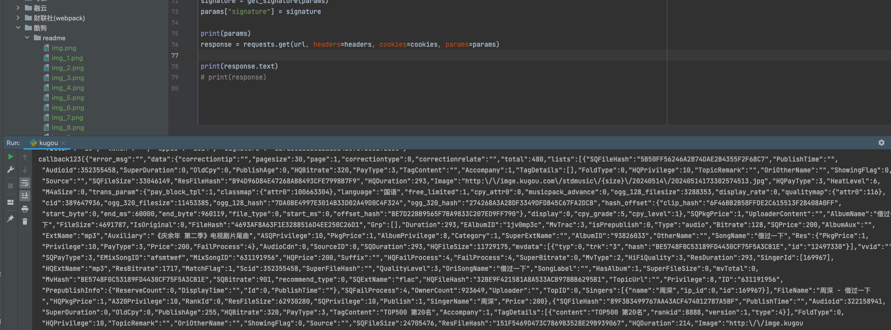


#### 有意思的是，最开始我找错位置了，还去找了一下mid，uuid这些值的来源，其实参数中已经带了的。
直接定位找s的值，打断点，刷新浏览器
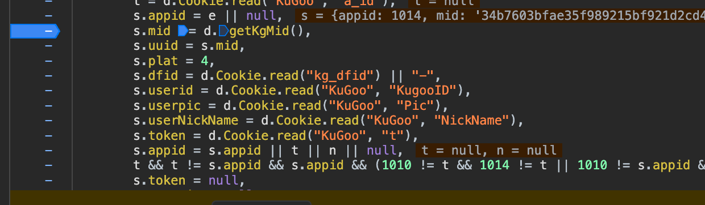
点击进入函数
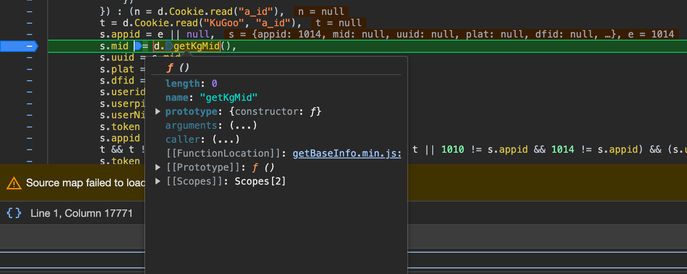
简单阅读一下逻辑
``` javascript
getKgMid: function() {
            var e = d.Cookie.read("kg_mid");
            if (navigator.cookieEnabled) {
                if (d.IsEmpty(e)) {
                    var n = d.Guid()
                      , e = d.Md5(n);
                    try {
                        d.Cookie.write("kg_mid", d.Md5(n), 864e6, "/", "kugou.com")
                    } catch (e) {}
                }
            } else {
                ...
                e = d.Md5(t + i + r + o + a + n)
            }
            return e
        },
```
这里，就是取cookie的kg_mid值，作为返回。如果没有cookie，通过d.Md5(n)生成"kg_mid"这个cookie值
```javascript
        Guid: function() {
            function e() {
                return (65536 * (1 + Math.random()) | 0).toString(16).substring(1)
            }
            return e() + e() + "-" + e() + "-" + e() + "-" + e() + "-" + e() + e() + e()
        }
```


## 任务2：下载页面中的每一首歌
1. 点击播放，发现新打开了一个页面
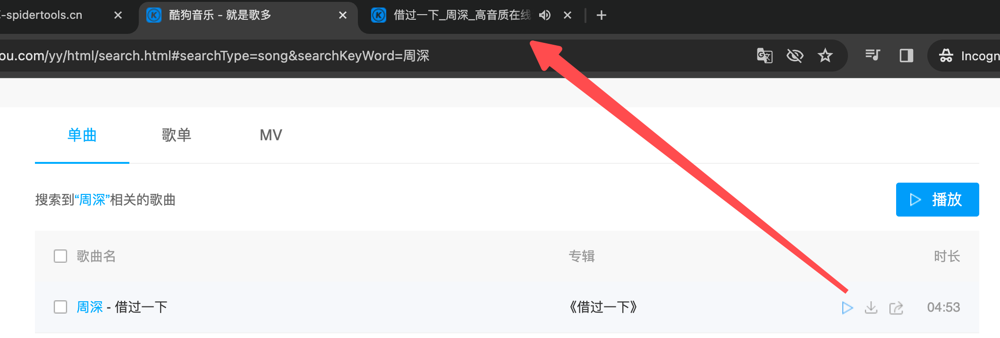
2. 在新页面，重新打开控制台，刷新，找到了mp3资源文件
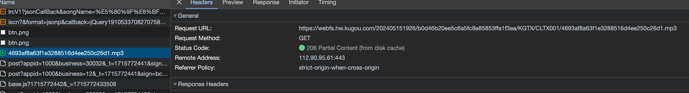
3. 查看文件链接，对比一下前面请求有没有这个链接，找到了接口`
https://wwwapi.kugou.com/play/songinfo` ，这个接口的返回数据包含了歌曲的链接
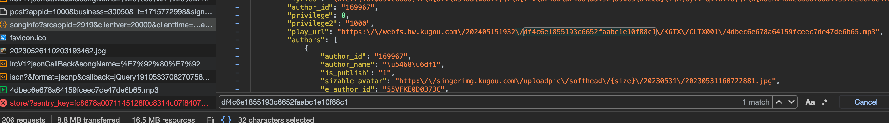
4. 查看请求参数，有一个encode_album_audio_id值，需要找找
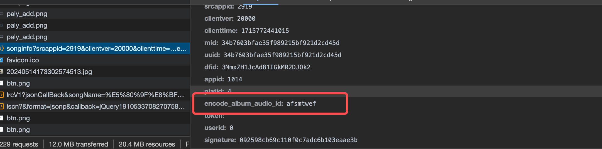
5. 猜测在之前的页面数据中会有，先去看看，果然在之前的网页找到了这个值。
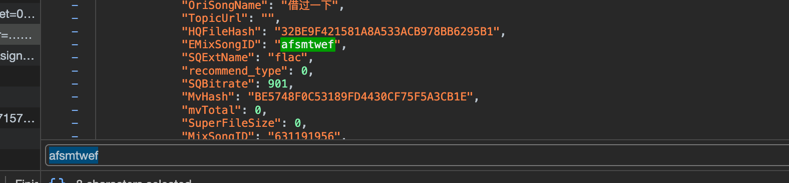
6. 那么下一步就提取所需要的EMixSongID 值，然后访问请求`https://wwwapi.kugou.com/play/songinfo` 来获取下载mp3地址
7. 值得注意的是返回数据不是标准的json格式，需要去掉首位一些内容
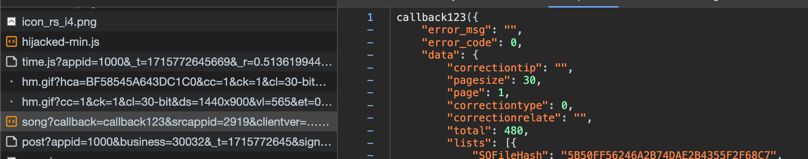