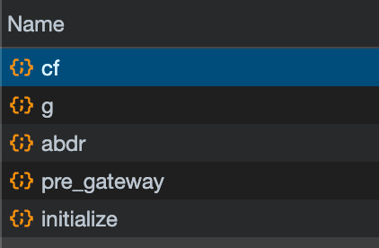

1. 目标是srcId，通过search直接搜索，定位到
            o.setFetchFunc(function(t, n) {
                var o = (0,
                E.default)(window, "srcId", "");
                o && Object.assign(e, {
                    srcId: o
                });

2.通过E.default找到函数
 function V(e, t, n) {
            var r = null == e ? void 0 : k(e, t);
            return void 0 === r ? n : r
        }
打条件断点  t == "srcId" && n==''

 3.找到了
         function k(e, t) {
            t = T(t, e) ? [t] : O(t);
            for (var n = 0, r = t.length; null != e && n < r; )
                e = e[D(t[n++])];
            return n && n == r ? e : void 0
        }

    查  e[D(t[n++])]，获得了srcId的值。最后发现window里面已经有srcId的值，那么肯定是之前就已经生成了

4. 清楚缓存数据，重新加载，发现设置了window.srcId
function(e) {
            return window.srcId = b.Base64.encode(JSON.stringify({
                t: e,
                r: window.location.href,
                os: "web",
                v: "0.1"
            }))

e = {data:xx,key_id:xx,sign:xx}

5. 发现  https://miao.baidu.com/abdr  这个接口返回数据就是e的值

6.这个接口有一个b64编码的参数，解码发现是{data:xx,key_id:xxx}
清空数据刷新页面，看到请求接口的顺序

7.唯一看不懂的就是cf接口的返回值，解码后是乱码，应该有加密逻辑。找路径cf，直接找到了位置
`return u("/h5/v3/cf", i, {
                    headers: {
                        "Content-MD5": (0,
                        s.makeDigest)(i.k, i.d, i.clientType)
                    }
                }).then((e=>(0,
                s.AESdecrypt)(e, n.key)))
            }`

看到了.then，那么解密逻辑就在这

